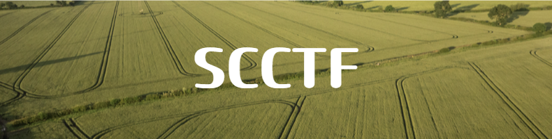
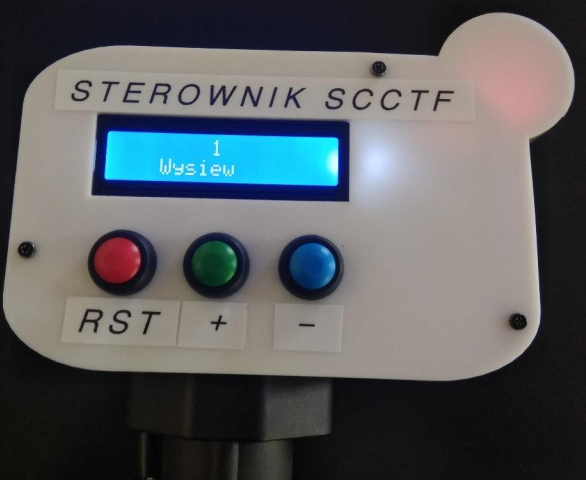

# Seeder Controller for Creating Tramlines in the Field

Process paths, are areas in fields that allow agricultural machinery to enter them without damaging the crops. They are created at the time of seeding. This is supervised (manually) by the machine operator, or by a special (very expensive) device supplied by the seeding machine manufacturer based on GPS technology.

The result of inaccurate or complete lack of tramlines, is inaccurate fertilization and crop spraying, which reduces the efficiency of these operations. Losses due to this can reach as high as 8%. This controller solves the problem of skipped paths caused by operator absentmindedness.