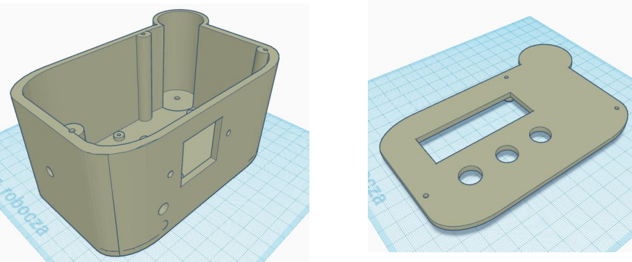
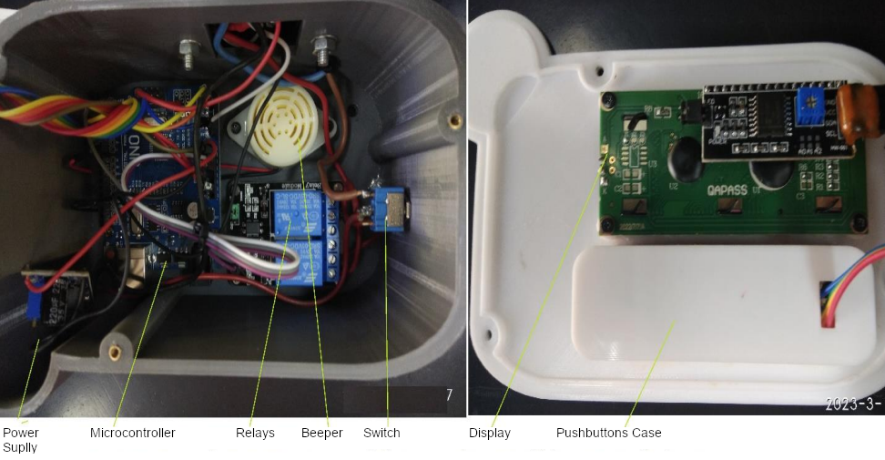
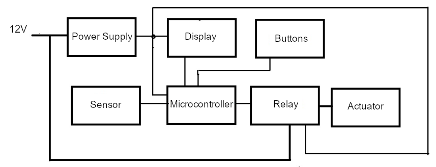
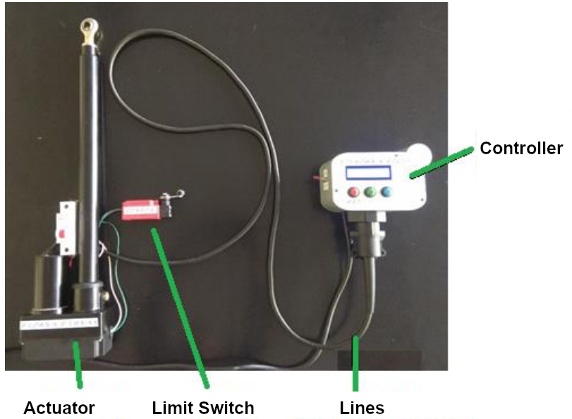
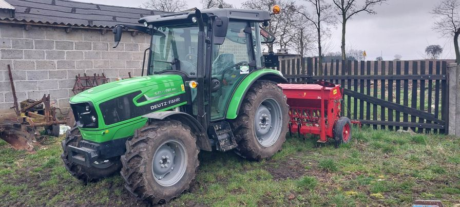
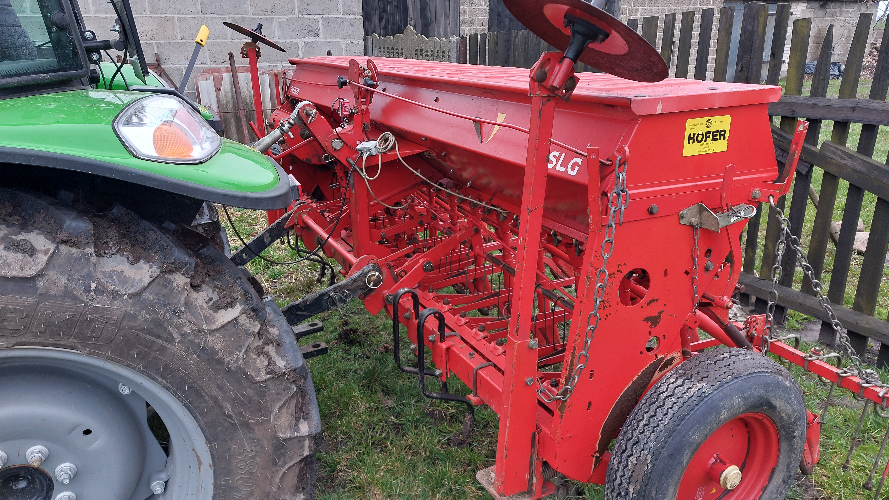
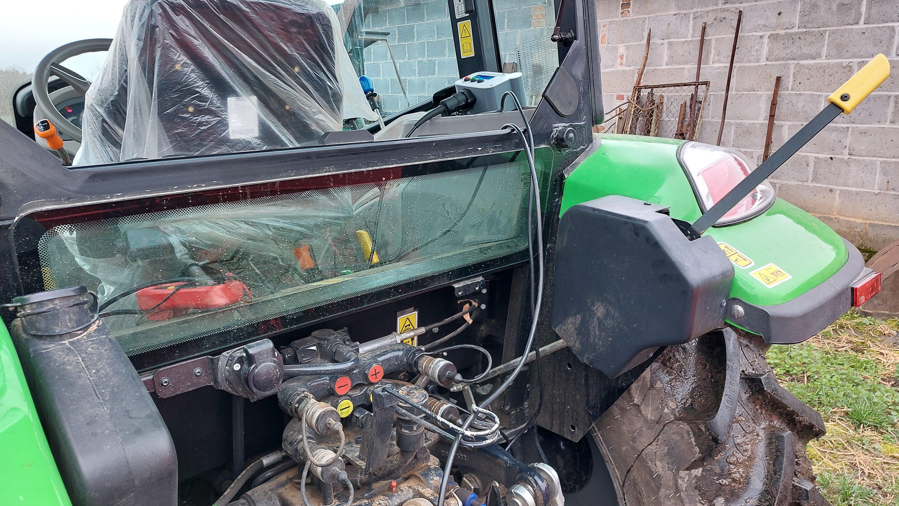
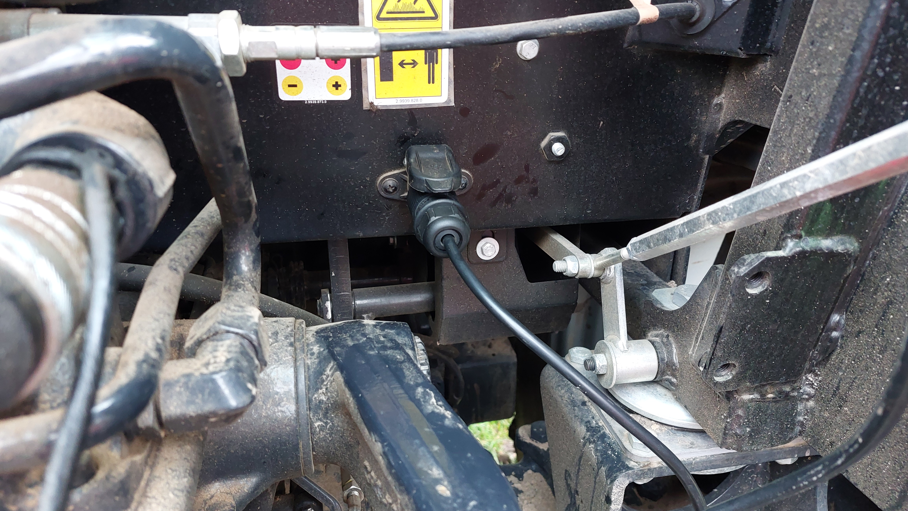
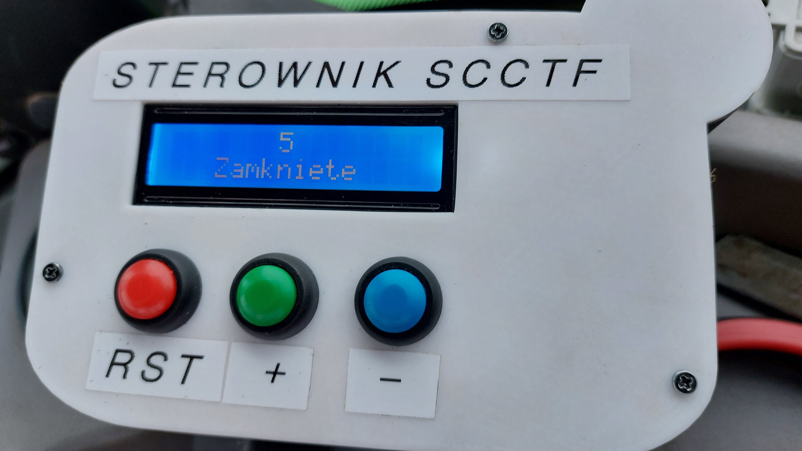

# Seeder Controller for Creating Tramlines in the Field

Field tramlines, are areas in fields that allow agricultural machinery to enter them without damaging the crops. They are created at the time of seeding. This is supervised (manually) by the machine operator, or by a special (very expensive) device supplied by the seeding machine manufacturer based on GPS technology.

The result of inaccurate or complete lack of tramlines, is inaccurate fertilization and crop spraying, which reduces the efficiency of these operations. Losses due to this can reach as high as 8%. This controller solves the problem of skipped paths caused by operator distraction.

## Case
The case were made using 3D printing technology so the design could resist the conditions of agricultural work (full dustproof).

## Components
- Arduino Uno with Atmega 328 microcontroller
- Beeper that signals the occurring
processes
- Two-channel relay module
- 2x16 LCD display with soldered I2C converter, which describes processes taking place in the device
- DC/DC voltage converter

## Working Principles
The operation of the device relies on the use of a microcontroller to control the actuator that closes or opens the suitable seeding sections.

The controller counts the passes of the vehicle with the help of a limit sensor (switch) mounted in the appropriate place of the seeder. During a certain pass with the relay, it engages the actuator and gives an acoustic signal 

## Usage
Currently, the controller is mounted on the machine of the person who ordered it. The device is field-proven after spring sowing.

 

 

 